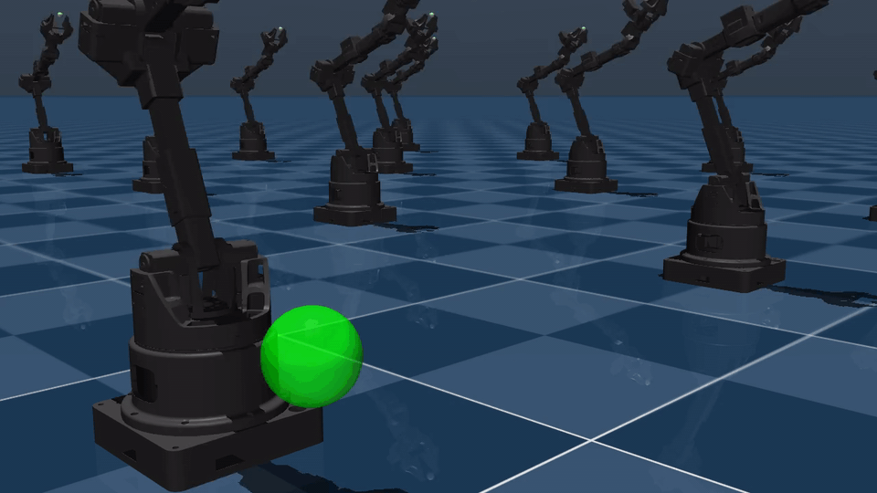
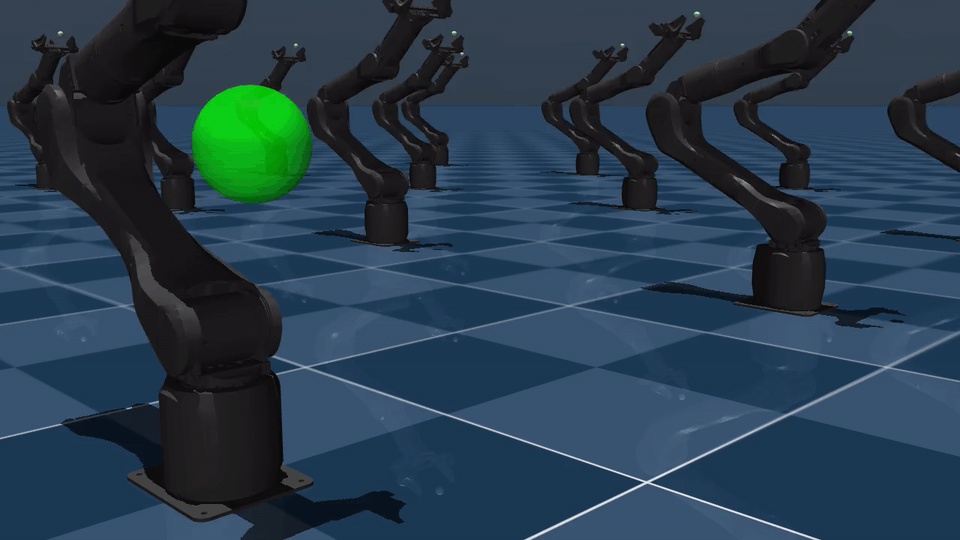
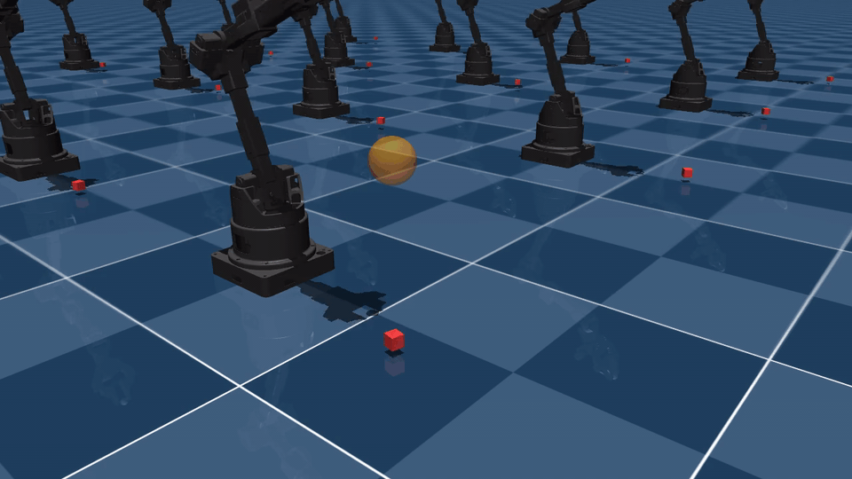

# Synria Mjlab

Synria robot learning tasks built with [mjlab](https://github.com/mujocolab/mjlab).
Robot MJCF/URDF assets are loaded from [synriard](https://github.com/Synria-Robotics/Synria-robot-descriptions) (no vendored XML).

Task layout follows [MuJoCo Playground](https://github.com/google-deepmind/mujoco_playground) taxonomy
(`manipulation/`, `locomotion/`), with mjlab manager-based registration.

## Tasks

| Task ID | Robot | Description | Demo |
|---------|-------|-------------|------|
| `Reach-Alicia-D` | Alicia_D | Move EE to target pose |  |
| `Reach-Alicia-M` | Alicia_M | Move EE to target pose |  |
| `Lift-Alicia-D` | Alicia_D | Lift a cube |  |
| `Lift-Alicia-M` | Alicia_M | Lift a cube | |
| `HandOver-Bessica-D` | Bessica_D | Dual-arm object handover | |
| `HandOver-Bessica-M` | Bessica_M | Dual-arm object handover | |
| `PegInsertion-Bessica-D` | Bessica_D | Dual-arm peg insertion | |
| `PegInsertion-Bessica-M` | Bessica_M | Dual-arm peg insertion | |
| `Velocity-Flat-Corina` | Corina | Flat-terrain velocity tracking | |
| `Getup-Flat-Corina` | Corina | Fall recovery on flat terrain | |

## Setup

Requires **Linux + NVIDIA GPU**. Driver CUDA 13.x (e.g. RTX 50-series) works with the default PyPI torch wheels. Assumes this layout:

```
Synria/
├── MJlab/
│   ├── mjlab/
│   └── Synria-Mjlab/      ← you are here
└── Synria-Robot-Descriptions/
```

### 1. Create and activate the conda env

```bash
cd Synria-Mjlab
conda env create -f environment.yml   # first time only
conda activate mjlab
```

### 2. Install GPU PyTorch (default PyPI / CUDA 13)

Avoid `--index-url .../cu128` on this machine — `nvidia-cusparselt-cu12` can hash-fail (empty download via NVIDIA mirror). Use default PyPI instead (same as a working `geo` env):

```bash
pip install "torch>=2.7.0"
```

Verify GPU:

```bash
python -c "import torch; print(torch.__version__, torch.cuda.is_available(), torch.version.cuda)"
```

### 3. Install MuJoCo, Warp, and MuJoCo-Warp

```bash
pip install "mujoco~=3.10.0"
pip install warp-lang
pip install "git+https://github.com/google-deepmind/mujoco_warp@6f235d4"
```

If `warp-lang` fails resolving NVIDIA deps, try:

```bash
pip install warp-lang --extra-index-url https://pypi.nvidia.com
```

### 4. Install local packages (editable)

```bash
pip install -e ../mjlab
pip install -e ../../Synria-Robot-Descriptions
pip install -e .
```

### 5. Verify

```bash
python -c "import mjlab, synriard, synria_mjlab; print('OK')"
list-envs | grep -E 'Reach|Lift|HandOver|PegInsertion|Velocity|Getup'
```

### Remove / recreate the env

```bash
conda deactivate
conda env remove -n mjlab
```

## Train / play

See **[docs/train_and_play.md](docs/train_and_play.md)** for full usage (checkpoints, W&B, Viser, video).

```bash
conda activate mjlab

# Train
train Reach-Alicia-D --env.scene.num-envs 4096

# Play (use Viser — safer over SSH / remote DISPLAY than native GLX)
play Reach-Alicia-D \
  --checkpoint-file logs/rsl_rl/reach_alicia_d/<run>/model_1499.pt \
  --viewer viser \
  --num-envs 1
```

Assets resolve via:

```python
from synriard import get_model_path
path = get_model_path("Alicia_D", version="v5_6", variant="gripper_50mm", model_format="mjcf")
```
